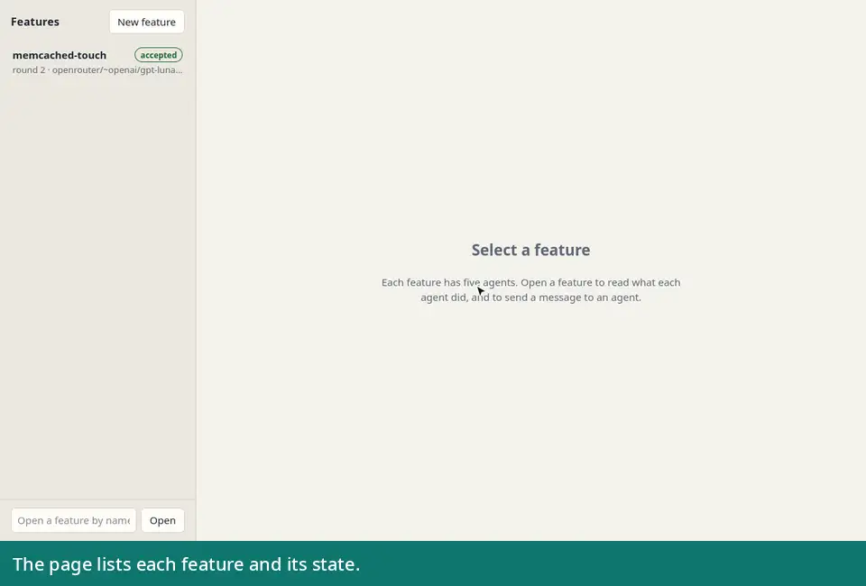

# pi-agent-celld-spike

A Helm chart that runs an agent harness on a Kubernetes cluster and keeps the state of each feature in an S3 bucket.

- [Pi Durable](https://github.com/earendil-works/pi/tree/main/packages/durable) is the harness.
- [celld](https://github.com/denoland/celld) is its database: one SQLite database for each feature, replicated to the bucket.
- [OpenSandbox](https://github.com/opensandbox-group/OpenSandbox) is the execution environment: one sandbox pod and one volume for each feature.

You give the chart a Git repository and a feature. Five agents then work on it: a researcher, an architect, an implementer, a tester, and a reviewer.
They write a research note, a PRD, an ADR, the code, the tests, a test report, and a review.
If the pod of the harness goes away, a new pod continues the work at the last checkpoint.

`docs/architecture.md` has the design, the decisions, and the test results.

## Run it

Prerequisites:

- The dev shell of this repository (see [Develop](#develop)).
- A Kubernetes cluster and its kubeconfig.
- A bucket with the name `pi-agent-celld-spike` on an S3-compatible object store.
- A SOPS file with the key pair of that object store, in the keys `access_key` and `secret_key`, and a working `sops` key.

Copy `.env.example` to `.env` and set `SPIKE_KUBECONFIG`, `S3_CREDENTIALS_FILE`, and `S3_ENDPOINT`.

Install or upgrade the release:

```sh
scripts/install.sh
```

The script reads the key pair of the object store from the SOPS file and gives it to Helm through a pipe.
The chart must be in the namespace `pi-agent-celld-spike`; the script sets it.

Start a feature:

```sh
scripts/api.sh PUT /features/feature-a-b-c examples/python-binary-memcached-touch.json
```

Follow it:

```sh
scripts/status.sh feature-a-b-c
scripts/api.sh GET '/features/feature-a-b-c/transcript?role=implementer&limit=20'
```

Or open the page of the worker; see [The page](#the-page).

Read the result after the pipeline ends:

```sh
scripts/api.sh GET /features/feature-a-b-c/artifacts
scripts/api.sh GET /features/feature-a-b-c/artifacts/docs/features/feature-a-b-c/adr.md
scripts/api.sh GET /features/feature-a-b-c/artifacts/patch > feature-a-b-c.patch
```

The checkout itself is in the sandbox, on the branch `feature/feature-a-b-c`:

```sh
kubectl -n pi-agent-celld-spike exec -it "$(kubectl -n pi-agent-celld-spike get pods -l feature=feature-a-b-c -o name)" -- \
  su dev -c 'cd /workspace/repo && git status'
```

A feature can also be a value of the chart. The chart then sends it after each install or upgrade:

```yaml
features:
  feature-a-b-c:
    repo: https://github.com/jaysonsantos/python-binary-memcached.git
    ref: main
    task: |
      Add a touch(key, time) method.
```

### The page

The worker serves one page at `/`. Get the address of the Service and open it in a browser:

```sh
kubectl -n pi-agent-celld-spike get service pi-agent-celld-spike-celld -o jsonpath='{.spec.clusterIP}'
```



The page has three parts:

- The list of the features, with the state of each one. "New feature" starts a pipeline.
- One tab for each agent. A tab shows the conversation of that agent: each prompt, each tool call with its output, and each answer. The page reads new entries each 2.5 seconds.
- A message box.

A message has one of three results:

| State of the feature | Result |
|---|---|
| The pipeline runs, and the agent is busy | The agent reads the message after its current tool calls. Then it continues its step. |
| The pipeline runs, and the agent is idle | The agent answers the message. |
| The pipeline is at its end | "Start a new round": the implementer makes the change, then the tester and the reviewer check it. Each agent keeps its conversation. "Ask ... only": one agent answers the message, and no round starts. |

The page has no login. Each person that can reach the Service can read the transcripts and send a message.

### Worker API

| Request | Result |
|---|---|
| `GET /` | The page. |
| `GET /features` | The list of the features. |
| `PUT /features/<name>` | Starts the pipeline. Body: `repo`, `task`, and optional `ref`, `rootSetup`, `userSetup`, `env`. The same request again changes nothing. |
| `GET /features/<name>` | Status: the pipeline, the agents, the sandbox, the token use, the bucket prefix. |
| `GET /features/<name>/transcript?role=<role>&limit=<n>` | The newest entries of one agent. Roles: `researcher`, `architect`, `implementer`, `tester`, `reviewer`. |
| `GET /features/<name>/chat?role=<role>&after=<id>` | The conversation of one agent as JSON, with what the agent does now. `after` gives only the entries after that entry id. |
| `POST /features/<name>/messages` | A message of the user. Body: `content`, and optional `role` and `mode`. `mode` is `agent` (to one agent) or `round` (a new round). |
| `GET /features/<name>/artifacts` | The list of the collected documents. |
| `GET /features/<name>/artifacts/<path>` | One document, or `patch` for the diff. |
| `GET /features/<name>/tasks` | The live tasks and submissions of the harness. |
| `POST /features/<name>/abort` | Stops the pipeline and each agent. |
| `DELETE /features/<name>` | Stops the pipeline and removes the sandbox. The transcripts stay. |

A feature name has lower-case letters, digits, and hyphens, and at most 50 characters.
The API has no authentication. The Service is `ClusterIP`; `scripts/api.sh` goes through the Kubernetes API server.

Send a message without the page:

```sh
echo '{"content": "Use a keyword argument for the time."}' > message.json
scripts/api.sh POST /features/feature-a-b-c/messages message.json
```

### Remove it

```sh
scripts/uninstall.sh                 # the release, the namespace, each sandbox, each volume
scripts/uninstall.sh --purge-bucket  # also the objects in the bucket
```

Remove one feature only:

```sh
scripts/api.sh DELETE /features/feature-a-b-c                                # the pipeline and the sandbox
kubectl -n pi-agent-celld-spike delete pvc workspace-feature-a-b-c           # the checkout
```

The transcripts of that feature stay in its cell in the bucket.

The bucket itself stays. Remove it with the tool that made it.

## Configure it

The settings are in `values.yaml`, each with a comment. The main ones:

| Value | Default | Meaning |
|---|---|---|
| `llm.api` | `faux` | `faux` is a scripted model without a key. A real model: `openai-completions`, `openai-responses`, or `anthropic-messages`. |
| `llm.baseUrl` | empty | Base URL of the model endpoint, as the SDK of that API expects it. |
| `llm.provider` | `gateway` | Provider id for pi-ai. Use `openrouter` for OpenRouter. |
| `llm.model` | `faux-1` | Model id. |
| `llm.authHeader`, `llm.authScheme` | `authorization`, `Bearer` | How the gateway sends the key. Anthropic: `x-api-key` and an empty scheme. |
| `pipeline.maxRounds` | `3` | Rounds of implement, test, and review. |
| `sandbox.image` | `python:3.13-bookworm` through the registry proxy | Image of each sandbox. It must be Debian-based and have git. |
| `sandbox.workspace.storageClass`, `.size` | `local-path`, `5Gi` | Volume of each feature. |
| `bucket.name`, `bucket.prefix` | `pi-agent-celld-spike`, `fleet` | Where celld keeps all state. |
| `bucket.endpoint`, `bucket.region` | empty, `eu-central-1` | The S3-compatible object store. `scripts/install.sh` sets the endpoint from `S3_ENDPOINT`. |
| `features` | `{}` | Features that the chart sends to the worker. |

Environment variables of the scripts. The scripts also read them from `.env`:

| Variable | Default | Meaning |
|---|---|---|
| `SPIKE_LLM_API_KEY` | empty | Key of the model endpoint. `scripts/install.sh` puts it in the Secret. Necessary for a real model. |
| `SPIKE_KUBECONFIG` | none | Kubeconfig of the cluster that gets the release. Necessary. |
| `S3_CREDENTIALS_FILE` | none | SOPS file with the key pair of the object store. Necessary for an install. |
| `S3_ENDPOINT` | none | URL of the object store. Necessary at the first install; the release keeps it. |
| `S3_AWS_PROFILE` | none | Profile of the AWS CLI for `scripts/uninstall.sh --purge-bucket`. |

Use a real model. `examples/llm-openrouter.values.yaml` has the settings for OpenRouter:

```sh
SPIKE_LLM_API_KEY=<key> scripts/install.sh \
  --values examples/llm-openrouter.values.yaml \
  --values examples/python-binary-memcached-touch.values.yaml
```

`scripts/install.sh` keeps the values of the last install. A later `scripts/install.sh` without options thus keeps the model, the features, and the key.
To start from the defaults of `values.yaml` again, run `RESET_VALUES=1 scripts/install.sh`. That command returns the release to the scripted model.
To remove one feature from the release, add `--set features.<name>=null`.

A pipeline keeps the model that it started with.
If the release gets a different model while a pipeline runs, that pipeline stops and waits. `scripts/status.sh <feature>` then shows a `BLOCKED` line.
The pipeline continues when the release has its model again.
So the scripted model cannot finish the work of a real model, and the `model:` line of the status tells which model made a result.

For another endpoint, set `llm.api`, `llm.baseUrl`, `llm.model`, and the header of the key.
Anthropic, for example: `llm.api=anthropic-messages`, `llm.baseUrl=https://api.anthropic.com`, `llm.authHeader=x-api-key`, and an empty `llm.authScheme`.

## Test the recovery

Each test below ran on the cluster on 2026-10-07 with the scripted model.
The scripted implementer runs one command for 45 seconds, so there is time to stop a pod.

`scripts/recovery-test.sh` runs the first and the last test of the table and checks the result:

```sh
scripts/recovery-test.sh harness   # kills the celld pod during the implement phase
scripts/recovery-test.sh sandbox   # kills the sandbox pod of the feature
```

The script needs the scripted model (`llm.api: faux`).

| Test | Command during the implement phase | Result |
|---|---|---|
| Kill the harness pod | `kubectl -n pi-agent-celld-spike delete pod pi-agent-celld-spike-celld-0 --grace-period=0 --force` | Two features ran at that time. Both continued in the new pod and ended with `accepted`. The 45 second command gave one complete result. |
| Replace the harness pod | `scripts/install.sh` with a changed value | Same result. |
| celld stops itself | No command: a slow bucket write | The container started again and the pipeline continued. |
| Kill the sandbox pod | `kubectl -n pi-agent-celld-spike delete pod -l feature=<name> --grace-period=0 --force` | The running command failed. OpenSandbox made a new pod, the worker ran the setup again, and the agent ran the command again. The pipeline ended with `accepted`. |

Check that two features do not share state:

```sh
scripts/status.sh feature-a-b-c | grep object
scripts/status.sh feature-c-b-a | grep object
kubectl -n pi-agent-celld-spike get pods,pvc -L feature
```

## Develop

```sh
direnv allow          # or: nix develop
pnpm install
scripts/all.sh        # the lint and the tests
```

`.envrc` is local. It has these lines:

```sh
source_up
dotenv_if_exists
use flake
```

| Command | Purpose |
|---|---|
| `scripts/lint.sh` | The prek hooks, the type check, and `helm lint`. |
| `scripts/test.sh` | The unit tests and a render of the chart. |
| `scripts/all.sh` | Both. |
| `scripts/fetch-celld.sh` | Puts the celld binary in `.tools/`. |
| `pnpm dev` | Runs the worker in `celld dev` on this machine, with local state in `.celld/`. |
| `scripts/deploy-local.sh` | Deploys the worker from this machine into the bucket. The node in the cluster takes it in 30 seconds. |

The worker needs the gateway for the model and for OpenSandbox, so `pnpm dev` alone only serves the routes that need neither.

## Release

This spike has no release. The chart version in `Chart.yaml` stays `0.1.0`.
